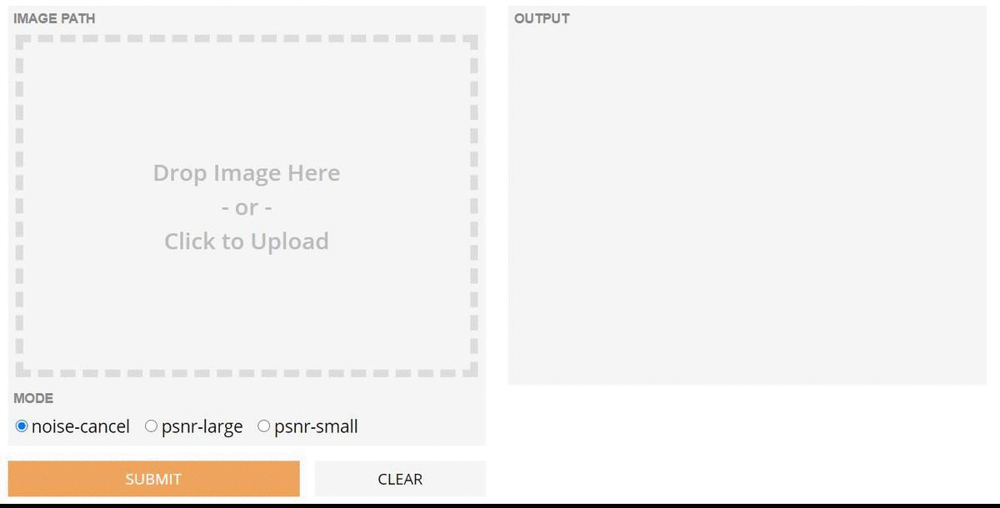

# ISR (Image Super-Resolution)

Upscale and improve the quality of low resolution images.
### Demo

<p align="center">
    
    <br>
    <sup>Authors <a Demo</a></sup>
</p>


### Installation
Python 3.6 
```
pip install ISR
```
### Prediction
```
TEST_RDN.ipynb
```

#### References:
* [Image Super-Resolution (ISR)] https://pypi.org/project/ISR/


